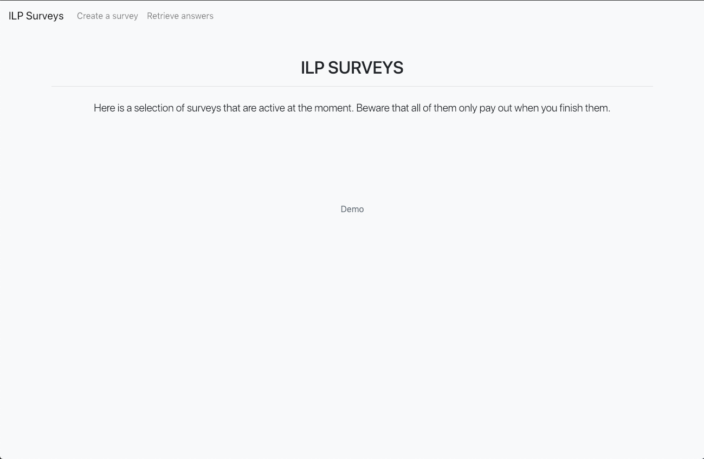
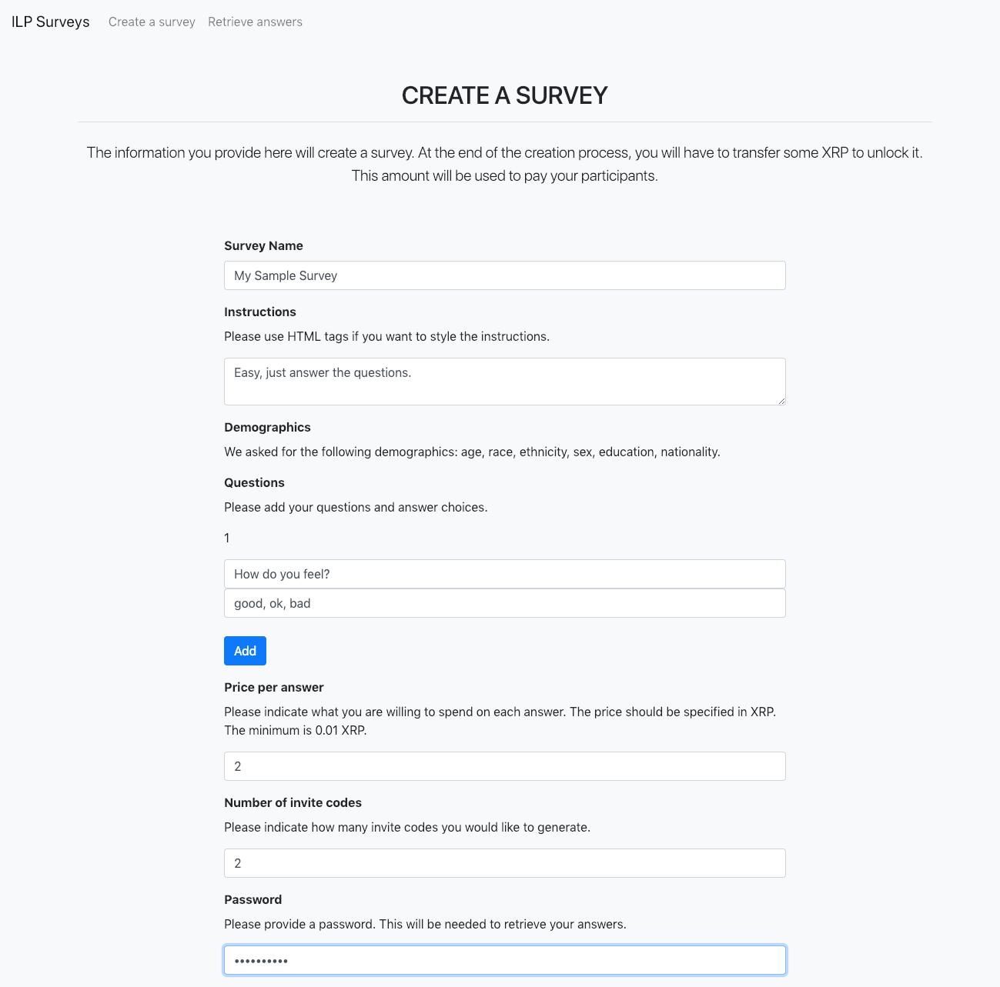
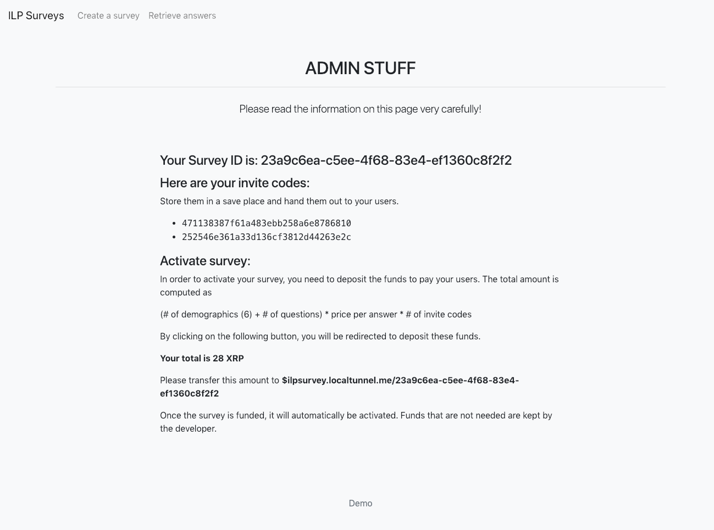
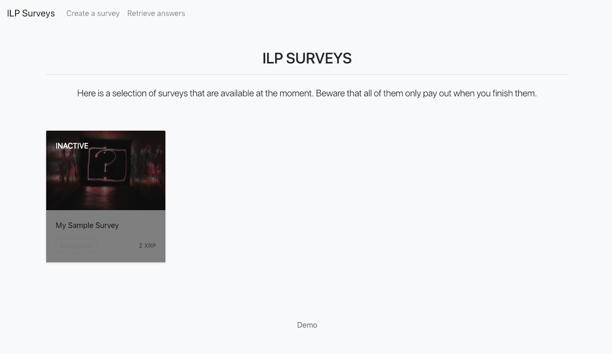
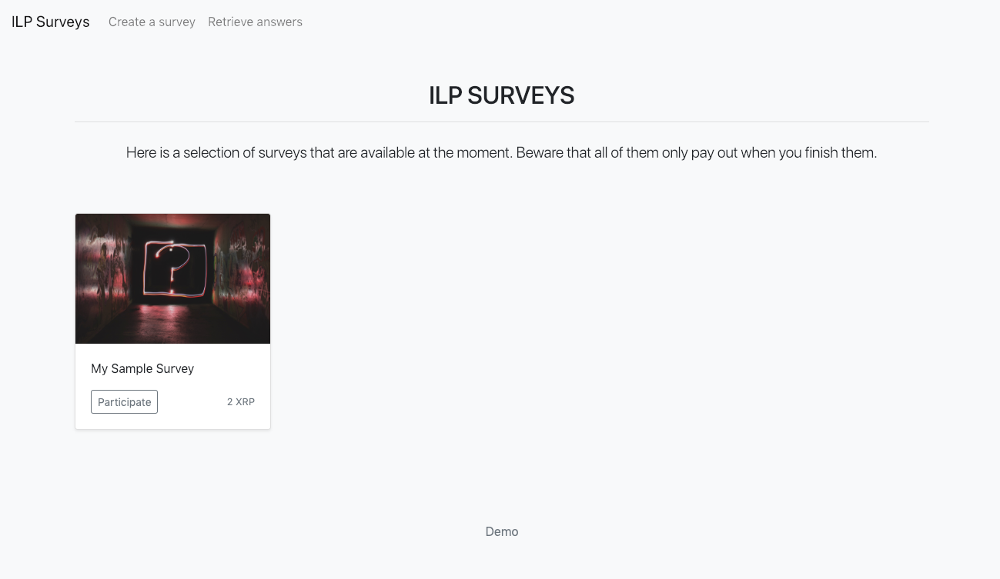
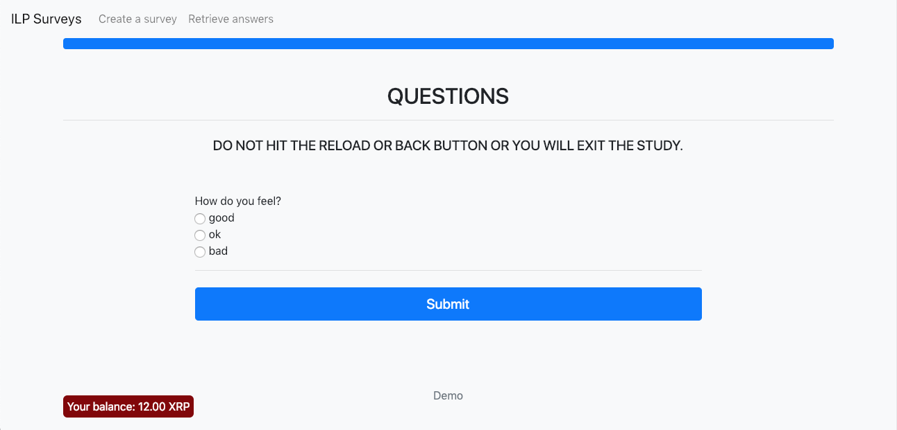
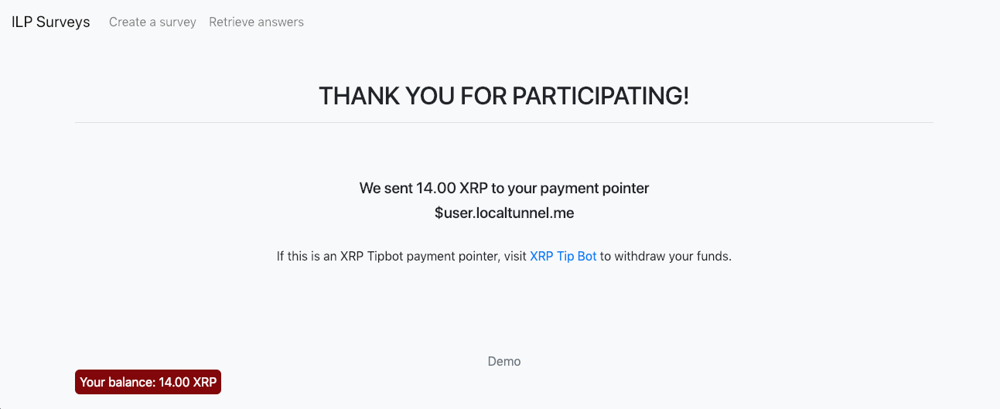
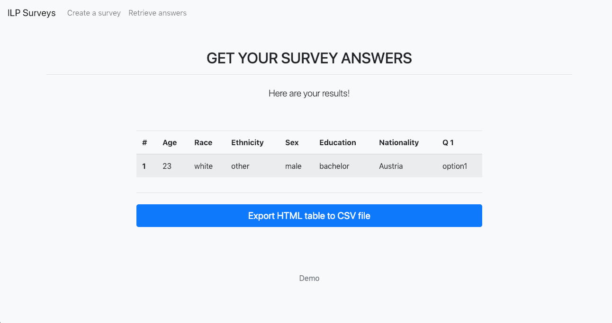

# ILP Survey

## Todo
- [ ] proper storage layer
- [ ] improve efficiency
- [ ] user handling
- [ ] prevent user from getting paid multiple times
- [ ] testing

## Introduction

This repository contains a PoC for one possible application of the [Interledger Protocol](https://interledger.org/). Researchers often face the challenge of a too little participation rates in their surveys. ILP survey pays participants for each answer they give on a survey. It incentivizes them to complete the whole survey because the payment is only triggered when they finish, sending the collected credit to their payment pointer. 

## Setup

This application uses [redis](https://redis.io/) as storage layer (which is not ideal but ok for a PoC). The easiest way to run a redis instance is by using docker.

    $ docker run -d --name surveys -p 6379:6379 redis

Survey payment details are represented as payment pointer details on the [ilp-spsp-prepaid-server](https://github.com/sabinebertram/ilp-spsp-prepaid-server) which needs to be running locally. Clone the repository and start it using

    $ SPSP_LOCALTUNNEL=true SPSP_LOCALTUNNEL_SUBDOMAIN=ilpsurvey npm start

 The subdomain name `SPSP_LOCALTUNNEL_SUBDOMAIN` does not have to be `ilp-survey`, since it can be specified as an environment variable in this application.

Furthermore, you will want to start a plain [ilp-spsp-server](https://github.com/interledgerjs/ilp-spsp-server) which represents your user. 

    ilp-spsp-server --subdomain user

Both of these SPSP servers require [moneyd](https://github.com/interledgerjs/moneyd). Please check its [Quick Start](https://github.com/interledgerjs/moneyd#quick-start) section for detailed installation instructions. 

Finally, clone this repository and install the necessary packages. Afterwards, start the application.

    $ npm install
    $ ILP_SERVER=ilpsurvey.localtunnel.me npm start

By default, the application can be reached at http://localhost:3000. However, you can also specify further environment variables.

## Environment Variables

| Name | Default | Description |
|:---|:---|:---|
| `PORT` | `3000` | port to listen on. |
| `HOST` | `localhost` | host to listen on. |
| `ILP_SERVER` | `ilpsurvey.localtunnel.me` | Domain where the [ilp-spsp-prepaid-server](https://github.com/sabinebertram/ilp-spsp-prepaid-server) can be reached and the survey payment information are stored. |
| `AUTH_TOKEN` | `test` | Bearer token for interacting with the [ilp-spsp-prepaid-server](https://github.com/sabinebertram/ilp-spsp-prepaid-server). |


## Usage

Navigate to http://localhost:3000. You will be welcomed by the following screen.



Create a survey by clicking the link in the navbar. 



Once you have configured the survey, you will be redirected to this page.



It holds all necessary information including the survey ID, invite codes the participants need to have, and the funds that need to be deposited in order to activate the survey. If you go back to the home page, the survey will show up but will be inactive.



To activate the survey, send the full funds to the survey's pointer

    $ ilp-spsp send -a 28000000 -r '$ilpsurvey.localtunnel.me/23a9c6ea-c5ee-4f68-83e4-ef1360c8f2f2'

You may need to install the command line tool [ilp-spsp](https://github.com/interledgerjs/ilp-spsp) by running `npm install -g ilp-spsp`.

In case you want to check the the payment pointer information before you process the payment, you may do so using the following GET request.

    $ http GET ilpsurvey.localtunnel.me/23a9c6ea-c5ee-4f68-83e4-ef1360c8f2f2 Accept:"application/spsp4+json"

The response will be 

```http
HTTP/1.1 200 OK
Connection: keep-alive
Content-Length: 386
Content-Type: application/spsp4+json
Date: Thu, 10 Jan 2019 22:44:59 GMT
Server: nginx/1.10.1

{
    "balance": {
        "current": "0",
        "maximum": "28000000"
    },
    "destination_account": "private.moneyd.local.zQqGsK6bg6q4J1TL00XvAdyL8v93VurOWLpnMgSzNb8.63swBEGQNvnn52vMRvBq-uag~23a9c6ea-c5ee-4f68-83e4-ef1360c8f2f2",
    "pull_balance": {
        "current_amount": "0",
        "maximum_amount": "0"
    },
    "receiver_info": {
        "name": "My Sample Survey"
    },
    "shared_secret": "dXGYytLMt8xCFh3a7tpfSbgmRuol4Y5ZHgVdrXGj67U="
}

```

Once the activation amount has been sent, the survey is available on the home screen. It displays the name of the survey as well as the price per question answered.



Hit "participate" to take the survey. Notice that your balance increases with each question answered.



Once you submitted the last answer, the balance will be automatically sent to the payment pointer you submitted in the beginning. 




Finally, the survey creator can retrieve the answers.

